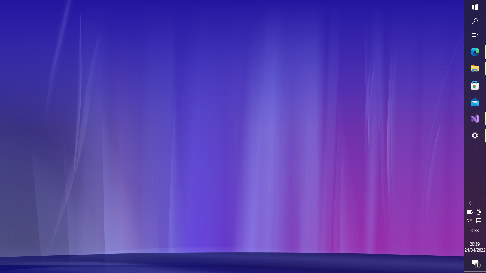

# Desktop Aurora

This project projects XAML files to the Windows wallpaper. 

## Usage
* Download a zip from Releases and unzip it
* Tip: You can download some Aurora XAMLs here: https://www.deviantart.com/dejco/art/Modified-Longhorn-aurora-xaml-96285001. 
* Then, place a file named "Aurora_Original.xaml" (without quotes) to the root of the unzipped directory. 
* Finnaly, run the "AuroraDesktop.exe" and enjoy!
* To stop the Aurora, run "StopAurora.cmd" script

## Roadmap:

  * Proof of Concept ✔️
  * Post the source code
  * Implement BAML reader
  * Support Windows versions older than Windows 10

## How does it work?
It makes use of C++/CLI to get "Desktop Walpaper HWND".
Than it creates child HwndSource and loads XAML with XamlReader.
It should be easy to implement BAML through the Baml2006Reader. (Now it looks that it isn't that easy)

## Current state
I've made a Proof of Concept application. It has really loaded Aurora XAML onto the wallpaper.
It is tested on Windows 10, but I want to support older versions (maybe also Windows Longhorn). 

## Ideas
  * Compile XAML to BAML for better performance
